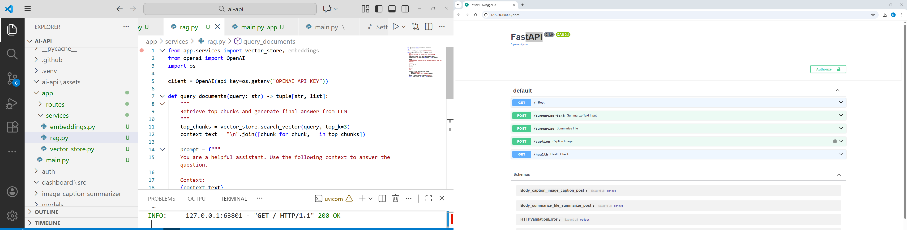

# AI API Service (Production-Ready Microservice)

This microservice includes robust API design, prompt engineering, caching, validation, observability, and deployment readiness.
<p align="center">
<<<<<<< HEAD
  
=======
  
>>>>>>> 269c7d1 (app/assets)
</p>
---

## Overview

DevStations is a backend AI microservice built with TypeScript (FastAPI version also supported).
It focuses on reliability, scalability, and clean architecture — not just calling LLMs, but doing it correctly, safely, and cost-effectively in production.

This repository showcases:

* Industrial-grade AI model integration
* Prompt engineering and structured responses
* Reliable error handling with retries & backoff
* Caching to reduce LLM cost & latency
* Security, monitoring, scalability, and CI/CD-ready deployment patterns

---

# Key Features

## **1. Prompt Engineering & AI Model Integration**

* Role-based few-shot prompting
* Structured JSON output enforcement
* Wrapper around OpenAI + future model adapters
* Schema validation for deterministic results

---

## **2. Data Processing & Validation**

* Strict input schema validation
* Normalization & sanitization layer
* Ready to extend for:

  * PDF processing
  * Log ingestion
  * Multi-step pipelines

---

## **3. Reliability & Resilience**

* **Retry w/ exponential backoff**
* **Redis caching** to avoid duplicate LLM calls
* Error-tolerant request flow
* Fully containerized (Docker)
* Supports horizontal scaling (Kubernetes-ready)

---

## **4. Security & Compliance (Partial / Improving)**

* Basic safeguards against invalid / unsafe outputs
* Extensible modules for:

  * **PII redaction** (regex/NER-based)
  * GDPR / HIPAA-friendly data flows
  * OpenAI Moderation API or custom filters

---

## **5. Monitoring & Cost Optimization**

Current:

* Request + error logging
* Cached-call optimization
* Payload minimization

Planned:

* Token-level cost tracking
* Prometheus/Grafana metrics dashboard
* Alerts for spikes in usage, cost, or latency

---

## **6. Deployment & Scalability**

* Clean microservice architecture (Node.js/TS + optional FastAPI)
* Dockerized for production
* CI/CD-friendly structure (GitHub Actions support)
* Designed for multi-instance scaling & traffic routing

---

# **Feature Roadmap (In Development)**

| Feature Area                                   | Status          |
| ---------------------------------------------- | --------------- |
| Kubernetes multi-instance scaling              |  In Progress  |
| Vector DB + RAG workflow (Pinecone / Weaviate) |  In Progress  |
| Message queues + DLQ (RabbitMQ / Kafka)        |  In Progress  |
| PII Redaction                                  |  Implementing |
| Moderation & Compliance                        |  Implementing |
| Cost dashboards & alerts (Prometheus)          |  In Progress  |

---

#  **Why This Project Matters**

This service mirrors the real responsibilities of a **Senior AI Integration Engineer**, including:

* Designing structured, safe prompt pipelines
* Integrating multiple LLMs reliably
* Ensuring cost-efficiency at scale
* Handling resilience, fallbacks, backpressure
* Enforcing compliance (PII, moderation, audits)
* Preparing microservices for cloud-native production environments

As more components (RAG, queues, observability) are added, this repository becomes a **complete showcase of enterprise-grade AI API engineering**.

---

#  **Quick Start**

```bash
git clone https://github.com/ManibalaSinha/devstations.git
cd devstations
npm install
npm run dev          # Start local dev server
npm run build        # Build for production

# Build Docker image
docker build -t devstations .
```

---

#  **Tech Stack**

* **TypeScript / Node.js**
* **FastAPI (optional Python implementation)**
* Redis (Caching)
* Docker
* OpenAI API
* Prometheus/Grafana (planned)
* Pinecone / Weaviate (planned for RAG)
* Kafka / RabbitMQ (planned)

---

#  **About**

**AI / Python / Backend Engineering**
Production-grade AI API service focused on prompt engineering, RAG pipelines, caching, monitoring, and secure cloud deployment.

🌐 Project website:
`https://manibalasinha.github.io/ai-api/`


